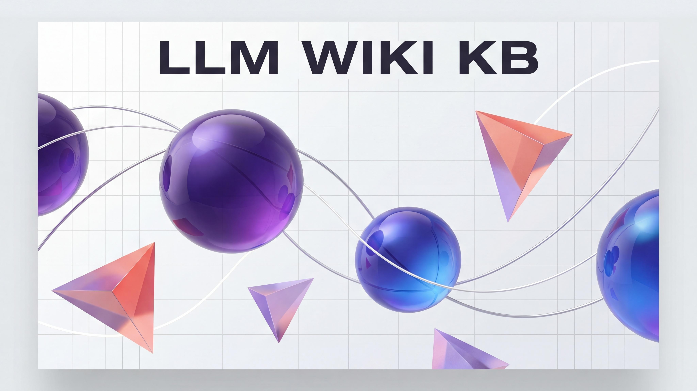

<div align="center">




# 🧠 LLM Wiki KB

**让 LLM 像人类专家一样，把零散知识编译成一部不断生长的百科全书**

**Let LLMs compile scattered knowledge into an ever-growing encyclopedia — just like a human expert would**

[](LICENSE)
[](https://python.org)
[](#-testing)

</div>

---

## 💡 灵感来源 · Inspiration

2025 年 4 月，Andrej Karpathy 发布了一篇 [LLM Wiki Gist](https://gist.github.com/karpathy/442a6bf555914893e9891c11519de94f)，提出了一个极具洞察力的观点：

> **RAG 每次都在重新推导答案，而 Wiki 把知识编译一次、复用无数次。**

他描述了一种三层架构：**原始素材 → LLM 编译的 Wiki → Schema 约定**，让 LLM 不再只是"检索-回答"的管道，而是成为一个持续积累知识的编纂者。这个想法本身就像一颗种子——Karpathy 有意将它设计为一份"可以直接粘贴到你自己 LLM Agent 里"的抽象描述。

**但种子需要土壤、阳光和水。**

---

In April 2025, Andrej Karpathy published an [LLM Wiki Gist](https://gist.github.com/karpathy/442a6bf555914893e9891c11519de94f) with a brilliantly simple insight:

> **RAG re-derives answers every time. A Wiki compiles knowledge once and reuses it forever.**

He described a three-layer architecture: **Raw Sources → LLM-compiled Wiki → Schema Conventions** — turning LLMs from "retrieve-and-answer" pipelines into persistent knowledge curators. The idea was intentionally abstract — "designed to be copy pasted to your own LLM Agent."

**But a seed needs soil, sunlight, and water.**

---

## 🎯 为什么要做这个项目 · Why This Project

Karpathy 的 Gist 是一份**设计文档**，不是一个**可运行的系统**。它描述了"应该做什么"，但没有回答：

- 📥 **怎样把一篇网页变成 Wiki 原始素材？** 图片怎么办？格式怎么处理？
- 🔍 **怎样在几百个 Wiki 页面中高效搜索？** 纯文本 grep 够用吗？
- 🏥 **怎样保证 Wiki 的健康度？** 死链接、孤儿页面、缺失的 frontmatter？
- 🔌 **怎样让不同的 LLM Agent 平台都能用？** Claude Code、OpenCode、Mira 各有各的约定。
- 📐 **怎样规范 Wiki 页面的结构？** 实体页、概念页、对比页的模板从哪来？

**LLM Wiki KB 把 Karpathy 的蓝图变成了一套即插即用的工具链。**

---

Karpathy's Gist is a **design document**, not a **runnable system**. It describes *what* to do, but leaves open:

- 📥 **How do you actually turn a webpage into raw material?** What about images? Formatting?
- 🔍 **How do you search efficiently across hundreds of wiki pages?** Is plain grep enough?
- 🏥 **How do you keep the wiki healthy?** Broken links, orphan pages, missing frontmatter?
- 🔌 **How do you support different LLM agent platforms?** Claude Code, OpenCode, and Mira each have their own conventions.
- 📐 **How do you standardize page structures?** Where do templates for entity pages, concept pages, and comparison pages come from?

**LLM Wiki KB turns Karpathy's blueprint into a plug-and-play toolkit.**

---

## 🚀 超越原版的优化 · What We Built Beyond the Original

<table>
<tr>
<th width="200">维度 · Dimension</th>
<th width="300">Karpathy 原版 · Original</th>
<th width="300">LLM Wiki KB 优化 · Enhancement</th>
</tr>
<tr>
<td><b>🛠 实现程度</b><br>Implementation</td>
<td>抽象描述文档，无可执行代码<br><i>Abstract description, no executable code</i></td>
<td><b>5 个 Python CLI 工具</b>：init / ingest / query / search / lint，共 1200+ 行生产级代码<br><i><b>5 Python CLI tools</b>, 1200+ lines of production code</i></td>
</tr>
<tr>
<td><b>📄 页面类型</b><br>Page Types</td>
<td>未指定<br><i>Not specified</i></td>
<td><b>5 种结构化页面</b>：Source / Entity / Concept / Comparison / Synthesis<br><i><b>5 structured page types</b> with YAML frontmatter templates</i></td>
</tr>
<tr>
<td><b>📊 输出格式</b><br>Output Formats</td>
<td>Markdown 输出<br><i>Markdown output</i></td>
<td><b>4 种输出格式</b>：Markdown / Marp 幻灯片 / 飞书文档 / Matplotlib 图表<br><i><b>4 output formats</b>: Markdown / Marp slides / Feishu / Charts</i></td>
</tr>
<tr>
<td><b>🔌 平台适配</b><br>Platform Support</td>
<td>单一 Agent 使用<br><i>Single agent usage</i></td>
<td><b>3 套平台适配器</b>：Claude Code（CLAUDE.md）/ OpenCode（AGENTS.md）/ Mira（飞书导出）<br><i><b>3 platform adapters</b>: Claude Code / OpenCode / Mira</i></td>
</tr>
<tr>
<td><b>🧪 测试覆盖</b><br>Testing</td>
<td>无<br><i>None</i></td>
<td><b>35 项端到端测试</b>，覆盖 7 个模块，全部通过<br><i><b>35 end-to-end tests</b> across 7 modules, all passing</i></td>
</tr>
<tr>
<td><b>👁 可视化前端</b><br>Frontend</td>
<td>未指定<br><i>Not specified</i></td>
<td><b>Obsidian 深度集成</b>：热重载、Dataview 查询、Web Clipper、Marp 预览<br><i><b>Deep Obsidian integration</b>: hot-reload, Dataview queries, Web Clipper, Marp preview</i></td>
</tr>
</table>

---

## 📚 5 种 Wiki 页面类型 · 5 Wiki Page Types

LLM Wiki KB 定义了 **5 种结构化页面类型**，每种都有特定的 YAML frontmatter 模板和写作规范：

### 1️⃣ Source Summary (`wiki/sources/`)
每篇导入的来源文档对应一个页面，记录原始素材的关键信息。

```yaml
---
title: "论文标题或文章名称"
type: source
author: "作者名称"
date: "YYYY-MM-DD"
url: "https://..."
status: ingested | summarized | integrated
topics: ["topic1", "topic2"]
entities: ["[[Entity1]]", "[[Entity2]]"]
concepts: ["[[Concept1]]", "[[Concept2]]"]
---
```

### 2️⃣ Entity (`wiki/entities/`)
实体页面记录具体的人、组织、产品、地点。

```yaml
---
title: "实体名称"
type: entity
aliases: ["别名", "缩写"]
category: person | organization | product | place | institution
sources: ["source-id-1", "source-id-2"]
---
```

### 3️⃣ Concept (`wiki/concepts/`)
概念页面记录抽象的技术、理论、方法论。

```yaml
---
title: "概念名称"
type: concept
aliases: ["别名"]
sources: ["source-id-1", "source-id-2"]
---
```

### 4️⃣ Comparison (`wiki/comparisons/`)
对比分析页面，并排比较两个或多个实体/概念/来源。

```yaml
---
title: "X vs Y"
type: comparison
subjects: ["[[X]]", "[[Y]]"]
---
```

### 5️⃣ Synthesis (`wiki/synthesis/`)
综合分析页面，将多个来源/实体/概念编织成跨主题的深度分析。

```yaml
---
title: "综合分析标题"
type: synthesis
theme: "主题"
sources: ["source-id-1", "source-id-2", "source-id-3"]
---
```

---

## 📤 导出功能 · Export Features

Wiki 内容可以导出为多种格式，方便分享和演示：

| 命令 | 输出格式 | 用途 |
|------|----------|------|
| `/wiki export feishu` | 飞书文档 | 团队协作、分享知识库 |
| `/wiki export slides` | Marp 幻灯片 | 演讲、汇报、分享 |
| `/wiki export report` | PDF / Markdown | 研究报告、论文附录 |
| `/wiki export chart` | Matplotlib 图表 | 数据可视化、趋势分析 |

---

## 🏗 架构 · Architecture

```
┌─────────────────────────────────────────────────────┐
│                   Your LLM Agent                     │
│           (Claude Code / OpenCode / Mira)            │
├─────────────┬─────────────┬─────────────┬───────────┤
│   Ingest    │    Query    │    Lint     │  Search   │
│  wiki_      │  wiki_      │  wiki_      │  wiki_    │
│  ingest.py  │  query.py   │  lint.py    │  search.py│
├─────────────┴─────────────┴─────────────┴───────────┤
│                  SKILL.md (Core Schema)              │
├─────────────────────────────────────────────────────┤
│                    Obsidian Vault                     │
│  ┌──────┐  ┌──────────┐  ┌──────────────────────┐  │
│  │ raw/ │→ │  wiki/    │→ │ output/ (md/marp/…)  │  │
│  │      │  │ index.md  │  │                      │  │
│  │      │  │ log.md    │  │                      │  │
│  │      │  │ entities/ │  │                      │  │
│  │      │  │ concepts/ │  │                      │  │
│  │      │  │ sources/  │  │                      │  │
│  │      │  │ synthesis/│  │                      │  │
│  └──────┘  └──────────┘  └──────────────────────┘  │
└─────────────────────────────────────────────────────┘
```

**三层数据流 · Three-Layer Data Flow:**

1. **Raw（原始素材）** — URL 或本地文件经 `wiki_ingest.py` 转为 Markdown，存入 `raw/`
2. **Wiki（知识编译）** — LLM 阅读原始素材，按 5 种页面类型模板编写 Wiki 页面，存入 `wiki/`，更新 `index.md` 和 `log.md`
3. **Output（输出制品）** — 通过 export 命令生成 Markdown、幻灯片、飞书文档或图表

**自动维护的索引文件 · Auto-Maintained Indices:**
- `wiki/index.md` — 主索引，包含所有页面的别名映射
- `wiki/_backlinks.json` — 反向链接索引
- `wiki/_absorb_log.json` — 吸收日志，记录哪些条目已被处理

---

## 📖 分平台使用指南 · Step-by-Step Usage by Platform

> 以下指南假设你已经 `git clone` 了本仓库。下文用 `<skill-path>` 指代 clone 下来的 `llm-wiki-kb/` 目录。
>
> The guides below assume you've cloned this repo. `<skill-path>` refers to the cloned `llm-wiki-kb/` directory.

---

### 🟣 Claude Code

Claude Code 是目前与本 Skill 最自然的搭配——它原生读取 `CLAUDE.md`，能直接读写本地文件系统，且可运行 Python 脚本。

Claude Code is the most natural pairing — it natively reads `CLAUDE.md`, has direct filesystem access, and runs Python scripts.

#### Step 1: Clone 并设置环境变量 · Clone & Set Env

```bash
git clone https://github.com/chengjialu8888/LLM-Wiki-KB.git
cd LLM-Wiki-KB

# 设置你的 Obsidian vault 路径（也可以新建一个）
export WIKI_VAULT=~/obsidian-vaults/my-research
```

#### Step 2: 初始化 Wiki · Initialize

```bash
python scripts/wiki_init.py $WIKI_VAULT --domain "你的研究领域"
```

这会在 `$WIKI_VAULT` 下创建完整的目录结构和 `SCHEMA.md`。

#### Step 3: 部署 Schema 到 Claude Code · Deploy Schema

```bash
# 将 schema 复制为 CLAUDE.md（Claude Code 自动读取此文件作为项目上下文）
cp $WIKI_VAULT/SCHEMA.md $WIKI_VAULT/CLAUDE.md
```

#### Step 4:（可选）配置 qmd 搜索引擎 · Optional: Configure qmd Search

如果你安装了 [qmd](https://github.com/tobi/qmd)，可以配置为 MCP 工具获得更强的混合搜索能力：

```bash
# 安装 qmd
go install github.com/tobi/qmd@latest
```

#### Step 5: 开始使用 · Start Using

在 Claude Code 中输入：

```
/wiki ingest https://example.com/article
/wiki absorb all
/wiki export slides
```

---

### 🟢 OpenCode (OpenClaw)

OpenCode 使用 `AGENTS.md` 作为项目级指令文件，概念与 `CLAUDE.md` 类似。

OpenCode uses `AGENTS.md` as the project-level instruction file, similar to `CLAUDE.md`.

#### Step 1: Clone 并设置环境变量 · Clone & Set Env

```bash
git clone https://github.com/chengjialu8888/LLM-Wiki-KB.git
cd LLM-Wiki-KB

export WIKI_VAULT=~/obsidian-vaults/my-research
```

#### Step 2: 初始化 Wiki · Initialize

```bash
python scripts/wiki_init.py $WIKI_VAULT --domain "你的研究领域"
```

#### Step 3: 部署 Schema 到 OpenCode · Deploy Schema

```bash
# 将 schema 复制为 AGENTS.md（OpenCode 自动读取此文件）
cp $WIKI_VAULT/SCHEMA.md $WIKI_VAULT/AGENTS.md
```

#### Step 4: 开始使用 · Start Using

在 OpenCode 中输入：

```
/wiki ingest https://example.com/article
/wiki absorb last 30 days
/wiki query "这个领域的主要趋势是什么？"
```

---

### 🔵 Mira (字节跳动内部 AI 助手)

Mira 是字节跳动内部的 AI 助手平台。本 Skill 已适配 Mira 的沙盒环境和工具集。

Mira is ByteDance's internal AI assistant platform. This skill is adapted for Mira's sandbox environment and toolset.

#### Step 1: 确认 Skill 已安装 · Verify Skill Installation

Mira Skill 应该已经安装在：
```
/opt/tiger/mira_nas/plugins/prod/<your-user-id>/skills/llm-wiki-kb/
```

包含：`SKILL.md`、`scripts/`、`references/`

#### Step 2: 初始化 Wiki（选择一种方式）· Initialize Wiki

**方式 A：当次会话使用（workspace）**
```bash
python /opt/tiger/mira_nas/plugins/prod/<your-user-id>/skills/llm-wiki-kb/scripts/wiki_init.py workspace/my-wiki --domain "AI Agent 研究"
```

**方式 B：跨会话持久化（userdata）**
```bash
python /opt/tiger/mira_nas/plugins/prod/<your-user-id>/skills/llm-wiki-kb/scripts/wiki_init.py userdata/my-wiki --domain "AI Agent 研究"
```

区别：
- `workspace/` — 当前会话有效，会话结束后清理
- `userdata/` — 跨会话持久保存，适合长期知识库

#### Step 3: 开始使用 · Start Using

在 Mira 对话中直接输入：

```
把这篇文章加入我的知识库：https://example.com/article
```

或：

```
/wiki ingest https://example.com/article
/wiki absorb all
/wiki export feishu  # 导出到飞书文档
```

#### Mira 环境注意事项 · Mira-Specific Notes

| 特性 | Mira 适配 |
|------|----------|
| 搜索 | 默认使用 grep + index.md（qmd 在沙盒中不可用） |
| 导出 | 支持飞书文档导出（使用 `upload_to_feishu_tool`） |
| 路径 | 使用 `workspace/` 或 `userdata/` 相对路径 |
| 持久化 | 只有 `userdata/` 下的内容会保留 |

---

### ⚪ 其他 AI 助手 / Generic AI Assistants

对于其他支持 skill 的 AI 助手（Cursor、Windsurf、GitHub Copilot Chat 等），遵循以下通用步骤：

For other AI assistants that support skills (Cursor, Windsurf, GitHub Copilot Chat, etc.), follow these general steps:

#### Step 1: Clone

```bash
git clone https://github.com/chengjialu8888/LLM-Wiki-KB.git
```

#### Step 2: 复制 SKILL.md · Copy SKILL.md

将 `SKILL.md` 的内容复制到你的 AI 助手对话中，或保存为项目级指令文件（具体文件名取决于平台）。

Copy the contents of `SKILL.md` into your AI assistant conversation, or save it as a project-level instruction file (filename depends on the platform).

#### Step 3: 初始化并运行 · Initialize & Run

```bash
python scripts/wiki_init.py ./my-wiki --domain "你的研究领域"
```

然后在对话中：

```
/wiki ingest https://example.com/article
/wiki absorb all
```

---

## 🛠 快速命令参考 · Quick Command Reference

| 命令 | 功能 | 示例 |
|------|------|------|
| `/wiki ingest <url/file>` | 导入素材 | `/wiki ingest https://paper.com/llm.pdf` |
| `/wiki ingest --batch <dir>` | 批量导入 | `/wiki ingest --batch ./downloads/` |
| `/wiki absorb [range]` | 吸收条目到 Wiki | `/wiki absorb last 30 days` |
| `/wiki query "<q>"` | 查询知识库 | `/wiki query "LLM 推理优化方法"` |
| `/wiki search "<term>"` | 全文搜索 | `/wiki search "transformer"` |
| `/wiki lint` | 健康检查 | `/wiki lint --fix` |
| `/wiki export feishu` | 导出飞书文档 | `/wiki export feishu` |
| `/wiki export slides` | 导出 Marp 幻灯片 | `/wiki export slides` |
| `/wiki export report` | 导出研究报告 | `/wiki export report` |
| `/wiki status` | 查看统计 | `/wiki status` |

---

## 🔍 搜索能力层级 · Search Capability Tiers

| 层级 | 工具 | 能力 | 适用场景 |
|------|------|------|----------|
| Tier 1 | `wiki_search.py` + grep | 全文搜索、标签过滤 | 中小型 Wiki (<100 篇) |
| Tier 2 | `wiki_search.py` + qmd | 混合搜索（BM25 + 向量） | 大型 Wiki (100-1000 篇) |
| Tier 3 | `wiki_query.py` | LLM 语义导航 | 复杂查询、综合分析 |

---

## 🧪 测试 · Testing

本 Skill 包含 35 项端到端测试，覆盖 7 个核心模块：

```bash
cd LLM-Wiki-KB
pytest tests/ -v

# 或运行特定测试
pytest tests/test_wiki_ingest.py -v
pytest tests/test_wiki_query.py -v
```

**测试覆盖模块：**
- `wiki_init.py` — Vault 初始化
- `wiki_ingest.py` — 素材导入（URL、文件、批量）
- `wiki_query.py` — 语义查询
- `wiki_search.py` — 全文搜索
- `wiki_lint.py` — 健康检查
- `wiki_export.py` — 导出功能
- `SKILL.md` — Schema 解析

---

## 🤝 与其他 Skill 的关系 · Relationship to Other Skills

| Skill | 关系 | 区别 |
|-------|------|------|
| **farzaa/wiki** (Gist) | **灵感来源** | 本 Skill 的架构基础，但原版是设计文档 |
| **LLM-Wiki-KB** (本 Skill) | **生产实现** | 完整的 CLI 工具链 + 5 种页面类型 + 多平台适配 |

本 Skill 可以看作是 **farzaa/wiki Gist 的生产级实现**，增加了：
- 可执行的 Python CLI 工具
- 5 种结构化的页面类型模板
- 导出到飞书/Marp/图表的功能
- 跨平台适配器（Claude Code / OpenCode / Mira）
- 35 项端到端测试

---

## 📄 许可证 · License

[MIT](LICENSE) © 2025 chengjialu8888

---

<div align="center">

**如果这个项目对你有帮助，请给它一个 ⭐️**

**If this project helps you, please give it a ⭐️**

</div>
